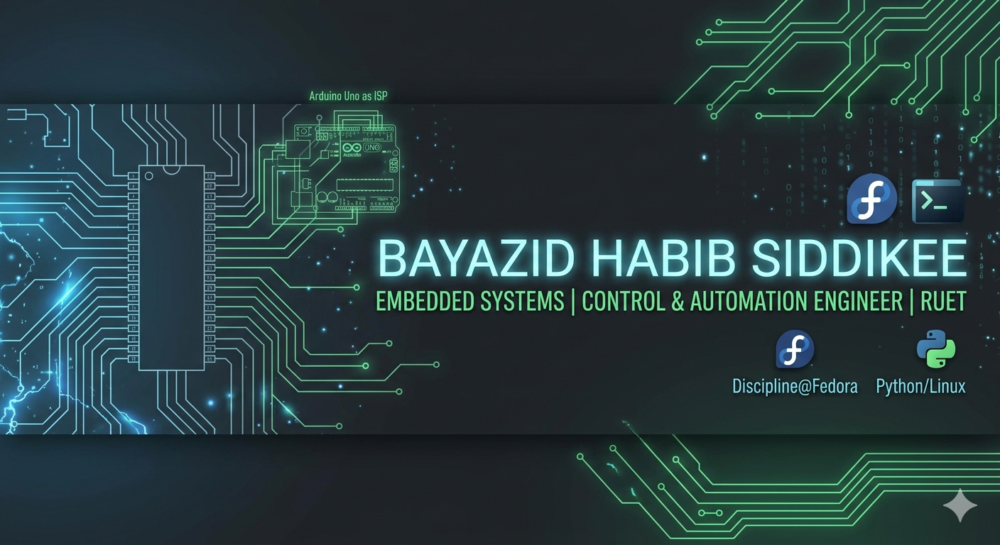

  

# Hi, I'm Bayazid 👋 

### 🤖 Control Systems & Embedded Engineer | RUET Department of Mechatronics Engineering
I build tools that bridge the gap between web interfaces and hardware (AVR/Arduino/Linux). Currently working on **Agentic AI** and interactive terminal systems.

---

### 📺 My YouTube Channel
I share technical walkthroughs and project demos here:
)

### 🔗 Connect with me:

---

### 🚀 Key Projects
- 🖥️ **Swordfish:** Custom web browser environment with any video download feature using yt-dlp.
- ⚡ **AVR Web Control Plane:** Web-based interface for flashing ATmega microcontrollers.
- 🐍 **Python Automation:** System-level tinkering on Fedora Linux.
- **AI Friends:** Working with API's or local Ollama models to create destinct personalities and make them work for you.
- **LFR:** A IoT project who can check black line on ground and walks with it.
- **CNC Math Plotter:** A CNC 2d axis machine connected to telegram, just write equation it will draw images virtually + physically and it uses NLP to understand normal texts like equations.

---

### 📊 GitHub Activity

  
  

