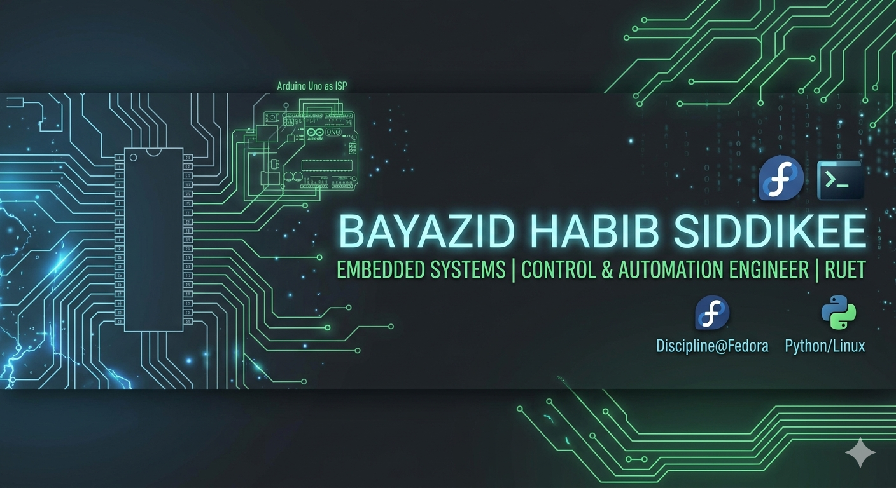

<p align="center">
  
</p>

<h1 align="center">Hi, I'm Bayazid HS 👋</h1>

<p align="center">
  <em>On a mission. Thinks differently. Loves to build.</em>
</p>

---

I'm a Mechatronics Engineering student at RUET who got tired of waiting to learn things in the right order.

So I built an OS. Then an AI. Then a CNC machine controlled from Telegram. Then a browser. Each one taught me something a course never could.

I work at the intersection of hardware and software — embedded systems, Linux, and AI — building tools that actually do something.

---

### What I Build With

```
Languages    →  C · C++ · Python · Shell
Frameworks   →  FastAPI · Flask · PySide6
AI / LLM     →  Ollama · LangChain · ChromaDB · FAISS · Kokoro TTS
Hardware     →  ATmega · Arduino · ESP32 · Raspberry Pi · PySerial
Vision       →  OpenCV · Pytesseract
Tools        →  avrdude · Docker · yt-dlp · Telegram Bot API · Git
Environment  →  Arch Linux · terminal-first
```

---

### 🚀 Things I've Built

**[Marin_OS](https://github.com/BayazidHabibSiddikee/Marin_OS)** — A Debian-based OS where an AI is the system owner. My first real system. Where I learned that controlling computers with code is just the beginning.

**[Marin_Evil_Sentinel](https://github.com/BayazidHabibSiddikee/Marin_Evil_Sentinel)** — An AI that doesn't let you slack. Tracks progress, enforces goals, removes distractions. Free to use via OpenRouter.

**[Marin_Kitagawa_v3](https://github.com/BayazidHabibSiddikee/Marin_Kitagawa_v3)** — FastAPI + LangChain + ChromaDB + VRM model support. Daily driver. The AI that started it all.

**[SwordFish](https://github.com/BayazidHabibSiddikee/SwordFish)** — A PySide6 browser built because nothing else worked the way I needed. Ad-blocker, PDF tools, video downloader, maps, translation. Built for focus.

**[CNC Math Plotter](https://github.com/BayazidHabibSiddikee/CNC-Math-Plotter)** — Write an equation in plain text. A machine draws it. Controlled from Telegram. Dockerized. A physical Desmos.

**[web_based_terminal](https://github.com/BayazidHabibSiddikee/web_based_terminal)** — Flash ATmega chips from a browser. No desktop IDE required.

**[Bayazid-Marin](https://github.com/BayazidHabibSiddikee/Bayazid-Marin)** — Two personalities, one system. One teaches and maps the path. The other makes anything understandable.

---

### 📊 GitHub Stats


---

### 📺 YouTube

Project walkthroughs and technical demos at **[@mtemind](https://www.youtube.com/@mtemind)**

---

### 🔗 Connect

[](https://www.linkedin.com/in/bayazid-habib-siddikee-4262412b3)
[](https://www.youtube.com/@mtemind)
[](https://github.com/BayazidHabibSiddikee)
[](mailto:2208053.mte.ruet@gmail.com)

---

<p align="center">
  
  
  
</p>

<p align="center"><em>Still learning. Still building. Still on the mission.</em></p>
